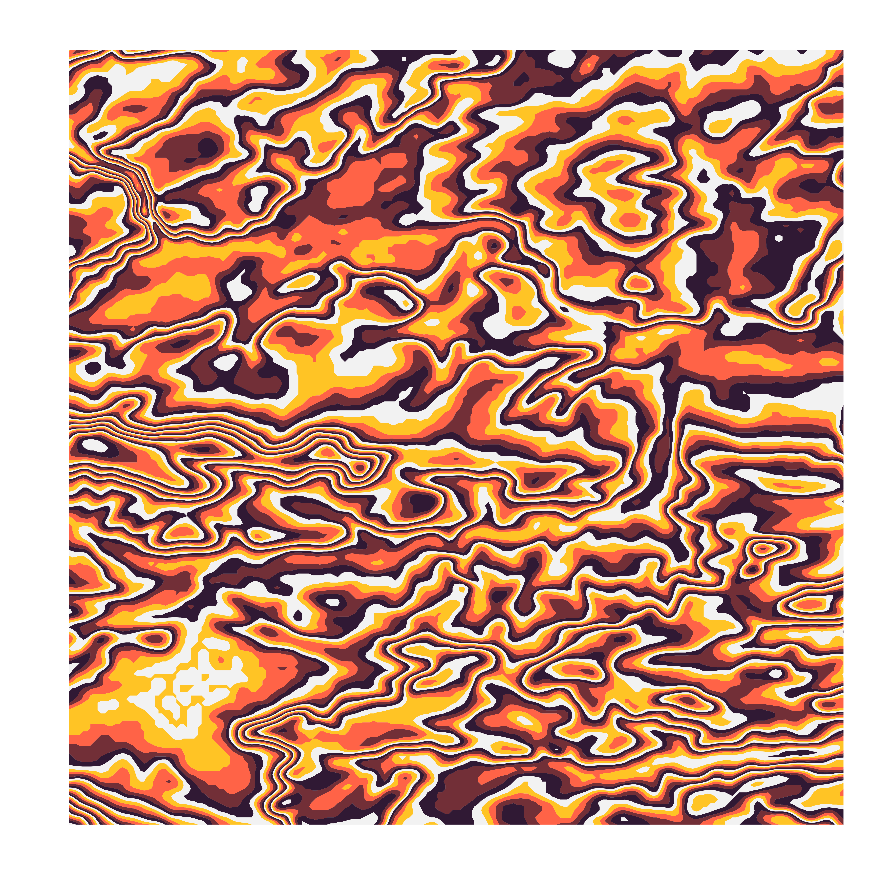

```{r setup, include=FALSE}
# Rmd setup
knitr::opts_chunk$set(
  echo = TRUE,
  warning = FALSE, message = FALSE,
  fig.path = "man/figures/",
  fig.height = 7, fig.width = 7
)
# Packages
devtools::load_all()
```

# **suminagashimap**: Making suminagashi-style topographic map art from elevation data

*Suminagashi* is a Japanese paper marbling technique. The **suminagashimap** package can be used to make *suminagashi*-inspired art in R from elevation data.

## Installation

The **suminagashimap** package can be installed directly from Github:
```{r, eval=FALSE}
devtools::install_github("sophiemeakin/suminagashimap")
```


## Quick-start

WIP.


## Examples

**Bristol, UK:**

