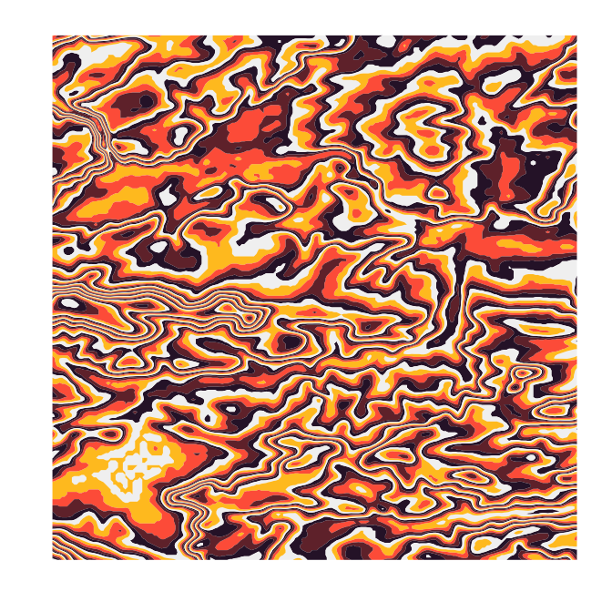

# **suminagashimap**: Making suminagashi-style topographic map art from elevation data

*Suminagashi* is a Japanese paper marbling technique. The
**suminagashimap** package can be used to make *suminagashi*-inspired
art in R from elevation data.

## Installation

The **suminagashimap** package can be installed directly from Github:

``` r
devtools::install_github("sophiemeakin/suminagashimap")
```

## Usage

For this example, we make a “*suminagashimap*” for Bristol, UK.

First, get boundaries of the relevant area, and then download the
elevation raster using `elevatr::get_elev_raster()`:

``` r
bd <- sf::st_crop(
  rgeoboundaries::geoboundaries("United Kingdom"),
  xmin = -2.7, xmax = -2.4, ymin = 51, ymax = 52
)
elev <- elevatr::get_elev_raster(locations = bd, z = 9, clip = "locations")
```

And you’re ready to go! Make the map using `suminagashi()`:

``` r
suminagashi(
  elev = elev,
  xlim = c(-2.65, -2.45), ylim = c(51.3, 51.5),
  pal_breaks = c(seq(0, 1000, 5)),
  pal = c("grey95", "#ffc425", "tomato", "#722F37", "#301934")
)
```


